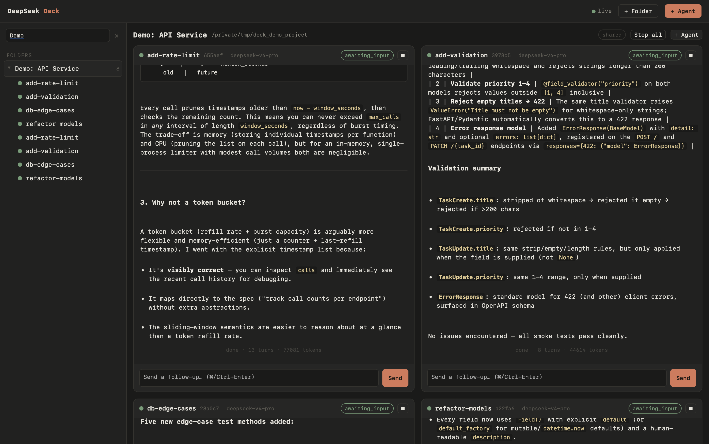
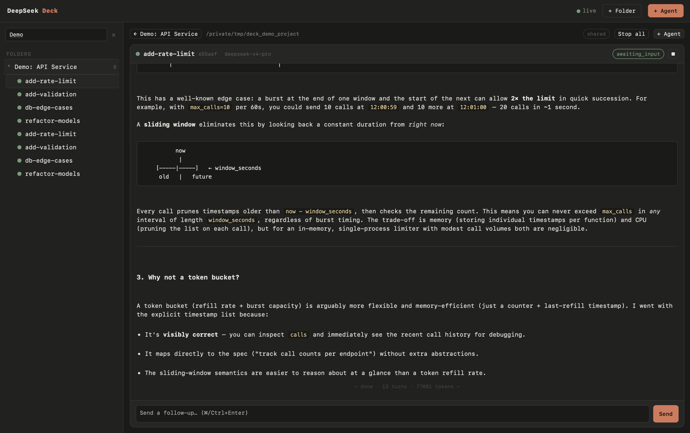
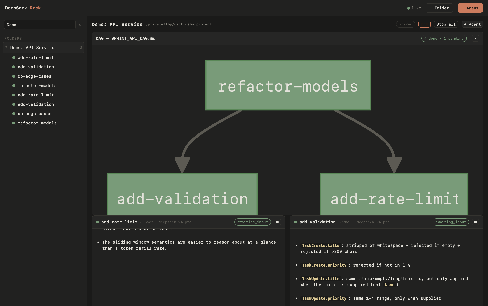

# DeepSeek Deck

An external, parallel, resumable **DeepSeek subagent runtime** with a
Claude-Code-lookalike web UI - and a `deck` CLI that a frontier model drives as if the workers were native Task subagents.

Anthropic doesn't let you extend Claude Code's native subagent system. The Deck
stitches an equivalent in from the outside: a frontier model orchestrates via
the CLI, DeepSeek does all the token-heavy execution, and you watch live panels
in the browser. **Frontier tokens are spent only on orchestration; worker
execution costs zero frontier tokens.**



## Why

| | Native Task subagent | `deepseek-runner` wrapper | **DeepSeek Deck** |
|---|---|---|---|
| Runs the work | frontier model | DeepSeek | DeepSeek |
| Frontier tokens per worker | full | a metered Claude session each | **~zero** (one CLI call in, compact summary out) |
| Live panel / resumable / parallel | yes | partial | **yes** |
| Human can watch & intervene | in-terminal | no | **web UI** |

## Claude Code Plugin

This repo is also a **Claude Code plugin** - install it to give Claude the four
skills (`deck`, `supervisor-dag`, `dsar`, `delegate-to-deepseek`) that teach it
to drive the Deck:

```bash
# Add as a marketplace (one-time):
claude plugin marketplace add https://github.com/Sarose550/deepseek-deck

# Then install the plugin:
claude plugin install deepseek-deck@deepseek-deck
```

Or add it manually in `~/.claude/settings.json`:

```json
"extraKnownMarketplaces": {
  "deepseek-deck": {
    "source": { "source": "github", "repo": "Sarose550/deepseek-deck" }
  }
}
```

After installing, Claude will pick up the four skills automatically. Before
using any `deck` commands, set `DEEPSEEK_DECK_HOME` to your repo root:

```bash
export DEEPSEEK_DECK_HOME=~/deepseek-deck
echo 'export DEEPSEEK_DECK_HOME="$HOME/deepseek-deck"' >> ~/.$(basename $SHELL)rc
```

## Layout

```
deepseek-deck/
  bin/deck                 # launcher (runs the CLI under the bundled venv)
  deck/
    config.py              # loads DeepSeek key/model from ~/.deepseek-mcp/config.json
    session.py             # streaming, resumable, full-duplex agent sessions + manager
    server.py              # FastAPI REST + WebSocket + serves the UI
    cli.py                 # the `deck` CLI (auto-boots the daemon)
    static/index.html      # the Claude-Code-lookalike UI (single file)
  .venv/                   # bundled virtualenv (fastapi, uvicorn, openai)
  requirements.txt
```

Tool implementations (Read/Write/Edit/Bash/Glob/Grep/NotebookEdit) and the
workspace sandbox are imported by path from the sibling
`deepseek-as-subagent` checkout (single source of truth - set
`DEEPSEEK_SUBAGENT_SRC` if it lives elsewhere).

State lives under `~/.deepseek-deck/` (sessions, transcripts, per-agent default
workspaces, `daemon.json`).

## Setup

Already provisioned on this machine. To recreate elsewhere:

```bash
python3 -m venv .venv
.venv/bin/pip install -r requirements.txt
# needs a DeepSeek API key in ~/.deepseek-mcp/config.json (or $DEEPSEEK_API_KEY)
```

## Desktop app (macOS)

Double-click **`DeepSeek Deck.app`** (in `/Applications`). It's a normal **Dock
app** (our icon) that opens the Deck in a native WKWebView window - no browser
chrome. Closing the window quits the app, but the **daemon and any running
workers keep going**, so relaunching from the Dock reliably reopens a window.
It also gives the page a **native folder picker** for choosing a folder's
project directory.

First launch: if Gatekeeper blocks the unsigned local app, right-click → Open once.
Under the hood it runs `deck.desktop` (pywebview); launch directly with
`.venv/bin/python -m deck.desktop`.

## Folders

The sidebar is organized into **folders** - each groups several agent panels and
carries the **project directory** its agents run in:

- A DAG/harness run creates one folder (named for the run, mounted at the
  project); ad-hoc workers land in **Unfiled** (isolated scratch dirs).
- Create/rename/archive/delete folders in the UI or via `deck folder …`.
- **Isolation** per folder: `shared` (default - agents work in the same dir) or
  `worktree` (each agent gets its own `git worktree` on its own branch).
- One folder is open at a time; opening it tiles its panels, clicking one agent
  focuses it. Switching folders never stops the workers.

## Use (CLI)

```bash
bin/deck up                       # start daemon, prints the UI URL
bin/deck open --launch            # open the UI in a browser

# folders (grouping + mount directory)
fid=$(bin/deck folder create --name "My Proj" --workspace ~/proj)  # prints id
bin/deck folder ls                # list folders

# spawn one worker into a folder (prints just an id)
id=$(bin/deck spawn --folder $fid --task "refactor foo.py to use pathlib")

bin/deck ps                       # list workers + status/turns/tokens
bin/deck result $id               # COMPACT outcome (the token firewall)
bin/deck send $id "now add tests" # follow-up; resumes the worker (full-duplex)
bin/deck log $id                  # FULL transcript - debugging only
bin/deck stop $id  / rm $id
bin/deck wave --file spec.json    # spawn many at once from a JSON list
bin/deck down                     # stop daemon
```

Workers are sandboxed to their `--workspace` (default: an isolated
`~/.deepseek-deck/workspaces/<id>`) and cannot run network/install commands.



## DAG board visualization

When you run a sprint with the `supervisor-dag` skill, the Deck automatically
detects your `SPRINT_*_DAG.md` board file and renders its mermaid diagram
live in the UI. Click the **DAG** button in the folder bar to see your whole
sprint at a glance, nodes are color-coded by agent status (green = done,
yellow = running, gray = pending). Click any node to jump to that agent's panel.



## How the frontier model drives it

The `deck` skill teaches the frontier model the CLI verbs and the token-firewall
discipline (`deck result`, not `deck log`). The `supervisor-dag` skill routes
every `Model: deepseek` node through `deck spawn` / `deck wave`, with the
frontier model as the only non-DeepSeek component of the session.
`delegate-to-deepseek` makes the Deck the default delegation path. `dsar` runs
an adversarial CRITIC/RESPONSE code-review loop entirely on Deck workers.

## Skills

This repo bundles the four Claude Code skills that drive the Deck, under
`skills/`. The **recommended** way to install them is via the Claude Code plugin
system (see [Claude Code Plugin](#claude-code-plugin) above).

You can also symlink them directly into `~/.claude/skills/`:

```bash
for s in deck delegate-to-deepseek dsar supervisor-dag; do
  ln -s "$(pwd)/skills/$s" ~/.claude/skills/$s
done
```

Claude Code picks up any directory under `~/.claude/skills/` automatically -
no restart needed beyond starting a new session.

| Skill | Does |
|---|---|
| `deck` | Teaches the frontier model the `deck` CLI verbs and token-firewall discipline. |
| `supervisor-dag` | Parent-supervisor DAG harness - parallel `Model: deepseek` nodes on the Deck. |
| `dsar` | Adversarial CRITIC/RESPONSE code review loop, both roles run as Deck workers. |
| `delegate-to-deepseek` | Default delegation heuristics; routes work to the Deck by default. |

`skills/delegate-to-deepseek` is a **derivative work** of the same-named skill
in [`PsChina/deepseek-as-subagent`](https://github.com/PsChina/deepseek-as-subagent)
(MIT License), modified to dispatch through the Deck instead of a native Task
subagent. See [`NOTICE`](NOTICE) for the original attribution.

## Full setup from scratch

```bash
git clone https://github.com/Sarose550/deepseek-deck.git ~/deepseek-deck
cd ~/deepseek-deck
python3 -m venv .venv
.venv/bin/pip install -r requirements.txt
export DEEPSEEK_DECK_HOME="$(pwd)"
echo 'export DEEPSEEK_DECK_HOME="'"$(pwd)"'"' >> ~/.$(basename $SHELL)rc

mkdir -p ~/.deepseek-mcp
cat > ~/.deepseek-mcp/config.json <<'EOF'
{ "api_key": "sk-...", "model": "deepseek-v4-pro" }
EOF
# or: export DEEPSEEK_API_KEY=sk-...

# tool implementations are imported from a sibling checkout - clone it too:
git clone https://github.com/PsChina/deepseek-as-subagent ../deepseek-as-subagent
# or set DEEPSEEK_SUBAGENT_SRC to wherever you keep it

bin/deck up
bin/deck open --launch

# Install the skills as a Claude Code plugin (recommended):
claude plugin marketplace add "$(pwd)"
claude plugin install deepseek-deck@deepseek-deck

# Or symlink them directly (legacy):
for s in deck delegate-to-deepseek dsar supervisor-dag; do
  ln -s "$(pwd)/skills/$s" ~/.claude/skills/$s
done
```

## License

MIT - see [`LICENSE`](LICENSE). Third-party attribution for the
`delegate-to-deepseek` skill is in [`NOTICE`](NOTICE).

## Architecture notes

- **Streaming loop** (`session.py`): async DeepSeek loop via `AsyncOpenAI`,
  reconstructs `tool_calls` + v4-pro `reasoning_content` from SSE deltas (the
  reasoning must be echoed back each turn or DeepSeek 400s), executes tools in a
  threadpool so N workers run truly in parallel (default cap 12).
- **Full-duplex**: a finished worker sits in `awaiting_input` with its history;
  `deck send` appends a user message and resumes it - no re-spawn.
- **Persistence**: every session's meta + messages + event log are on disk;
  the daemon rehydrates them on restart.
- **Token firewall**: `deck spawn` returns only an id; `deck result` returns
  only the compact summary. Full transcripts stay in the daemon and the UI.
