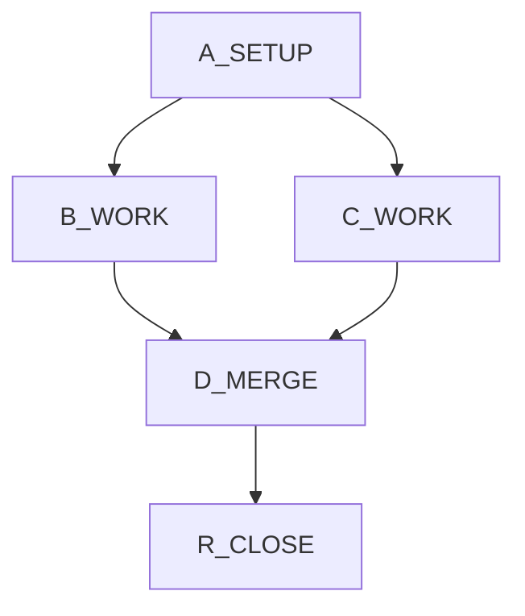

# SPRINT_<NAME>_DAG

<!--
Live strike board managed by the supervisor-dag skill.
Ephemeral — DELETE at R_CLOSE. Not design or decisions law.
-->

## Graph

## Lanes

| Lane      | Nodes             | Default owner |
|-----------|-------------------|---------------|
| infra     | A_SETUP           | supervisor    |
| feature-x | B_WORK            | deepseek      |
| feature-y | C_WORK            | deepseek      |
| land      | D_MERGE, R_CLOSE  | supervisor    |

## Conflicts

| Resource                                    | Rule                                                                | Nodes touching |
|---------------------------------------------|---------------------------------------------------------------------|----------------|
| `src/schema.sql`                            | Serialized                                                          | A_SETUP        |
| Tip git commit                              | Supervisor only                                                     | D_MERGE        |
| B_WORK Allowed files (Model: deepseek)      | Supervisor Read/Edit denied via `.claude/settings.local.json`       | B_WORK         |
| C_WORK Allowed files (Model: deepseek)      | Supervisor Read/Edit denied via `.claude/settings.local.json`       | C_WORK         |

## Nodes

### [ ] A_SETUP

- **Model:** `supervisor`
- **Depends:** none
- **Allowed files:** `src/schema.sql`, `DESIGN.md`
- **Exit criteria:**
  - Schema decision recorded in `DESIGN.md`
  - `src/schema.sql` migrated locally, `pytest tests/schema -q` green
- **Kill deadline:** 15 min
- **Binding law:** `DECISIONS.md §schema-v2`

### [ ] B_WORK

- **Model:** `deepseek`
- **Depends:** A_SETUP
- **Allowed files:** `src/feature_x/**/*.py`, `tests/feature_x/**/*.py`
- **Exit criteria:**
  - `pytest tests/feature_x -q` green
  - No imports from `src/feature_y/`
- **Kill deadline:** 45 min
- **Binding law:** `DESIGN.md §feature-x`
- **Pre-flight context:** (paste WebSearch / WebFetch material here before dispatch)

### [ ] C_WORK

- **Model:** `deepseek`
- **Depends:** A_SETUP
- **Allowed files:** `src/feature_y/**/*.py`, `tests/feature_y/**/*.py`
- **Exit criteria:**
  - `pytest tests/feature_y -q` green
- **Kill deadline:** 45 min
- **Binding law:** `DESIGN.md §feature-y`
- **Pre-flight context:** (paste WebSearch / WebFetch material here before dispatch)

### [ ] D_MERGE

- **Model:** `supervisor`
- **Depends:** B_WORK, C_WORK
- **Allowed files:** `src/main.py`, workspace root
- **Exit criteria:**
  - Feature X + Y wired into `src/main.py`
  - Full test suite green
  - One tip commit tagged with sprint name
- **Kill deadline:** 20 min

### [ ] R_CLOSE

- **Model:** `supervisor`
- **Depends:** D_MERGE
- **Allowed files:** `STATUS.md`, `TODO.md`, `DECISIONS.md`, this board
- **Exit criteria:**
  - Docs updated
  - No leftover `.claude/.dag-deny-backup.json`
  - No stale `permissions.deny` in `.claude/settings.local.json`
  - This board deleted

## Wave log

| Wave | Nodes dispatched | Deny lock written at | Deny lock released at | Notes |
|------|------------------|----------------------|-----------------------|-------|
| W0   |                  |                      |                       |       |
| W1   |                  |                      |                       |       |
